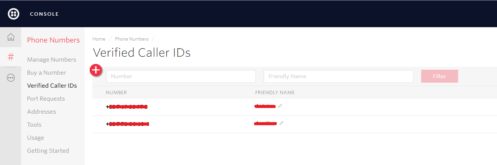
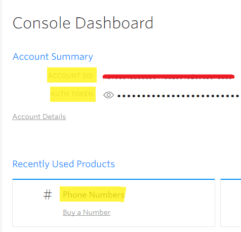
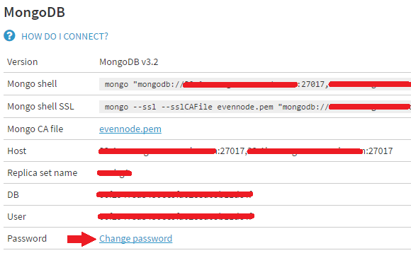
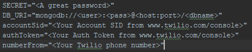
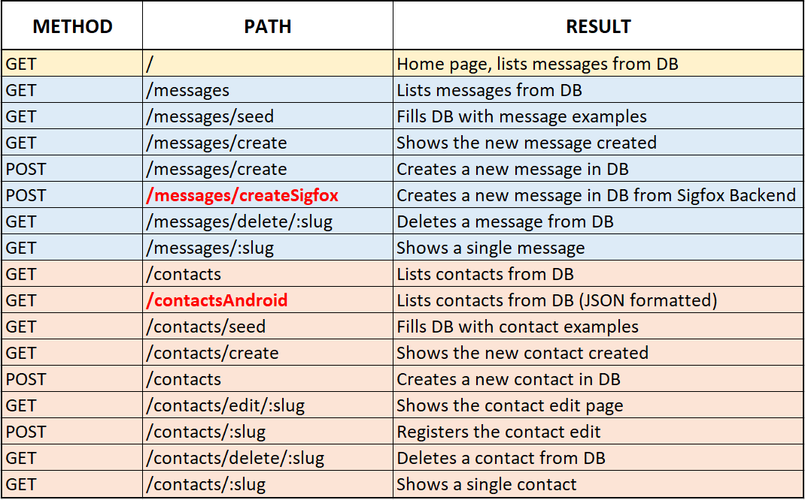
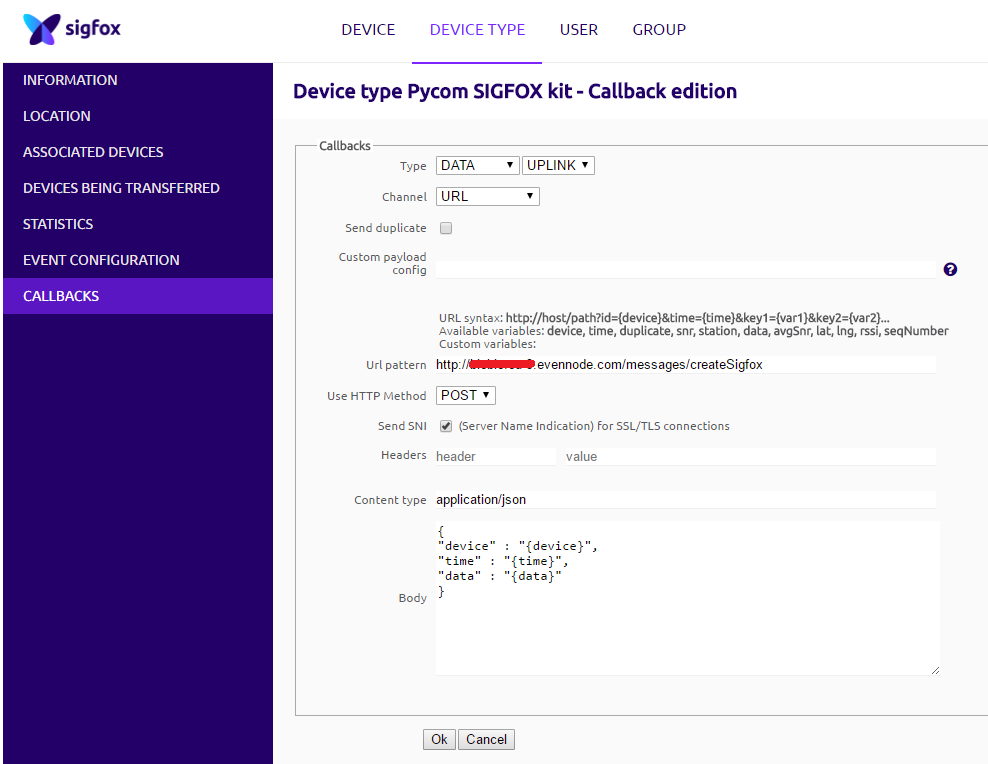
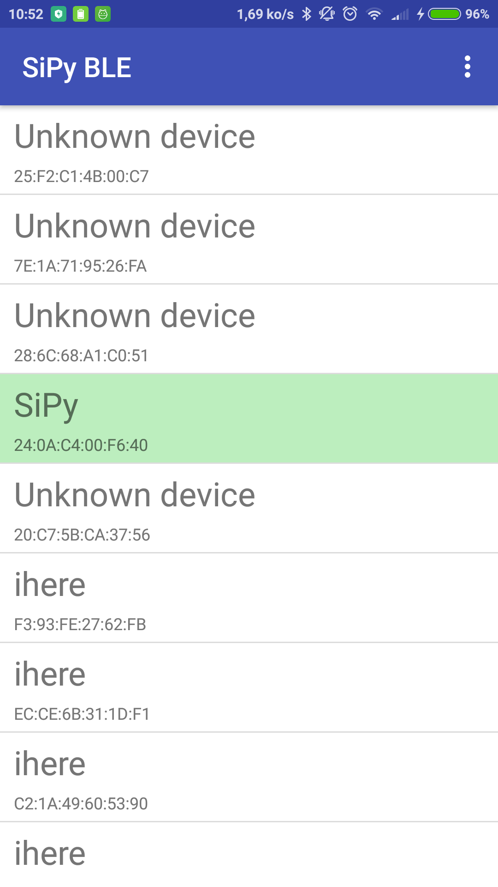
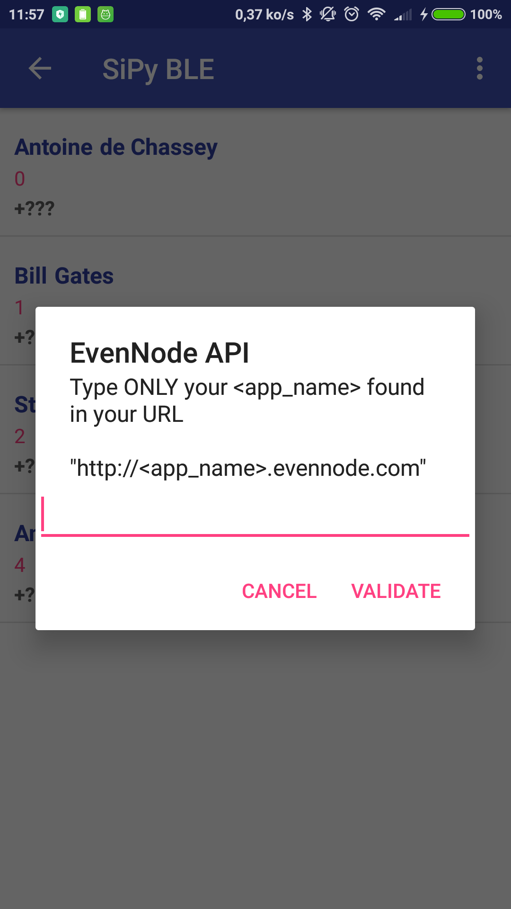
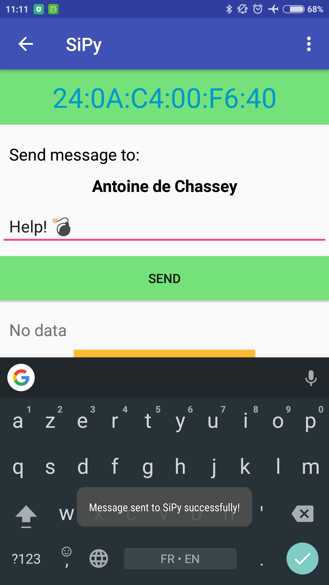

# [Sigfox](http://www.sigfox.com/) texting with [SiPy](https://www.pycom.io/product/sipy/)

You wish you could send some short SMS with __no SIM card__ and from almost anywhere? Well you can with Sigfox and BLE!

This repository includes:
- the firmware to upload on the SiPy
- an Android application to communicate to the SiPy with Bluetooth _BLE_
- the API registering requests from the Sigfox Backend and forwarding them by SMS with Twilio

    

## Hardware Requirements

- a [SiPy](https://www.pycom.io/product/sipy/) board (+ an expansion board used for flashing)
- an Android phone with Bluetooth (BLE supported)

## Installation
Clone the repo: `git clone https://github.com/AntoinedeChassey/SiPy_BLE_texting.git`

### SiPy
1. [Activate](https://backend.sigfox.com/activate/pycom) your SiPy on the Sigfox Backend _(you can follow __[this](https://docs.pycom.io/pycom_esp32/pycom_esp32/tutorial/includes/sigfox-start.html)__ tutorial)_
2. Flash the SiPy with the firmware located in this folder: _SiPy_BLE_texting/__SiPy___ (you can use the Pymakr Plugin, I __strongly recommend__ to read __[this](https://docs.pycom.io/pycom_esp32/pycom_esp32/getstarted.html#)__ guide)

### Twilio
1. Sign up for free __[here](https://www.twilio.com/try-twilio)__
2. Add new numbers in the "Verified Caller IDs" section (phone numbers of the contacts you wish to send messages)

    

3. Take note of your generated Twilio __Phone Number__, __ACCOUNT SID__ and __Auth TOKEN__

    

### EvenNode
1. Sign up for free __[here](https://www.evennode.com/new-account)__
2. Log in EvenNode and create a Node.js free plan
3. Make sure to set the MongoDB password
4. Now go in the "Environment vars" section (https://admin.evennode.com/a/d/<YOUR_APP_NAME>/environment-vars) and set the following variables:
    * `SECRET` : `<A great password>`
    * `DB_URI` : `mongodb://<user>:<pass>@<host:port>/<dbname>`
    * `accountSid` : `<Your Account SID from www.twilio.com/console>`
    * `authToken` : `<Your Auth Token from www.twilio.com/console>`
    * `numberFrom` : `<Your Twilio phone number>`

    

    

5. Once done, make sure you are in the API folder in order to ONLY push the web app to Evennode and not the whole repository previously cloned: `cd SiPy_BLE_texting/API`
6. Follow the Git deployment guide from the beginning: <https://www.evennode.com/docs/git-deployment>
7. You may have to wait 1 or 2 minutes for the app to start-up
8. Check if it runs correctly, you can debug with the "app logs": `https://admin.evennode.com/......./logs`
9. Create one or two contacts in order to fill the DB (use valid phone numbers, same as the ones you entered on Twilio)

#### But how does the API work?

Briefly, the Node.js web application has the following endpoints configured (you can have a look in _SiPy_BLE_texting\API\app\routes.js_). The two main ones are in red.

    

* `/messages/createSigfox` is called from the Sigfox Backend in order to store the incoming message from the SiPy and send it by SMS with Twilio.

The data sent from the SiPy is composed as the following:
> The first byte (unsigned: from 0 to 255, which equals 2^8 - 1) represents the __"contactId"__ (-> we can store 256 different contacts).

> The eleven remaining bytes (chars) represent the __"message"__ content.

* `/contactsAndroid` is called from the Android applicaiton to retrieve the contacts stored in the Mongo database (they are then stored in the Android SQLite DB so you can access the contact list without Internet).

### Sigfox Backend Callback
1. Log in __[here](https://backend.sigfox.com/auth/login)__
2. Go to <https://backend.sigfox.com/devicetype/list>, click left on your device row and select "Edit"
3. Now go to the "CALLBACKS" section on the left, select "new" on the top right, select "Custom Callback"
    * Url pattern: `http://<EvenNode_URL>/messages/createSigfox`
    * Use HTTP Method: `POST`
    * Content Type: `application/json`
    * Body: `{
             "device" : "{device}",
             "time" : "{time}",
             "data" : "{data}"
             }`

    

4. Select "OK" to validate
    
### Android
1. Download the apk file from <https://github.com/AntoinedeChassey/SiPy_BLE_texting/raw/master/Android/BLE_to_SiPy.apk> (or find it in _SiPy_BLE_texting/Android/BLE_to_SiPy.apk_)
2. Click on it and select "install" (you might have to authorize unsigned apps to be installed on your device)

## Usage

1. Launch the Android app and connect to your SiPy after authorizing Bluetooth

    

2. Press the `+` button to select a contact
3. At first boot, you need to update the local SQLite database with the contacts you created online (on the EvenNode Node.js app), you will be prompted to do so
4. Enter the name of your Node.js app (the part after `http://` and before `.evennode.com`)

    

5. Validate, you should now see the same contacts you created online!
6. Pick one, enter some text and send!

    

7. Wait 5 seconds and go back to your Node.js app, in the "Messages" section
8. You should now see the message you just sent with BLE
9. If your contact recipient has a valid phone number __activated on Twilio__, he should have received the text message by SMS!

_Sorry this project is a bit complicated due to all the different technologies used_.

Above all, it is to show what you could do with __SIGFOX__ and __BLE__, thanks to __SiPy__!

__Have fun!__

> *Antoine de Chassey*
